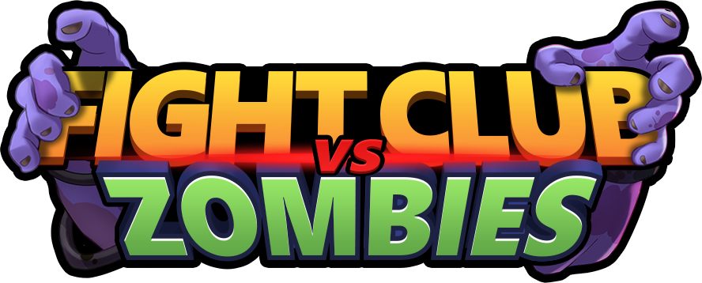
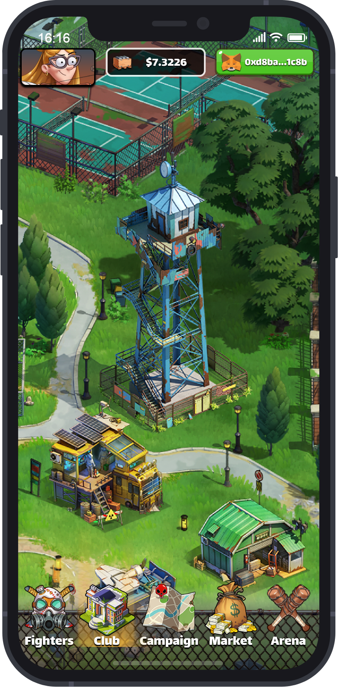

# Zombie Fight Club

> 🧟 超过瘾的NFT丧尸对战元宇宙游戏来啦！  
> 🛠 集合众多的末日斗士们，一起建设庇护所，对抗丧尸！

Fight Club vs Zombies是一款基于区块链技术开发的NFT僵尸对战社交游戏。

在遭受2019年末的最强病毒肆虐后，变异后的僵尸们蔓延到整个世界，为数不多的幸存者们组成了Fight Club，团结起来建设庇护所，一同对抗僵尸。

玩家是Fight Club的管理者，每个Fighter都是独一无二的NFT资产，玩家可以招募、购买和出售自己的Fighter，组成强大的Fight Club，与其他玩家一起对抗僵尸。

同时，Fight Club的庇护所是另外一种NFT资产。玩家还可以建设、经营自己的庇护所，可以从其他玩家手中购买新的区域以扩大自己的庇护所面积。

战斗和经营是这个游戏的核心，每个玩家都不需要任何初始投资便可免费开始游戏，通过自己的努力和社交即可获得真正有价值的NFT资产。

我们将手机平台作为游戏的核心平台，让玩家随时随地进行游戏。


真正实现free-to-play到play-to-earn的转变


## 愿景

* 设计有趣且充满策略的战斗和经营玩法，为受到疫情影响而减少娱乐活动的玩家们带来丰富的游戏体验。
* 构建基于play-to-earn动态经济体系，帮助全球因疫情影响导致收入降低的劳动者们也能实现收入的增长和社交的延拓。

