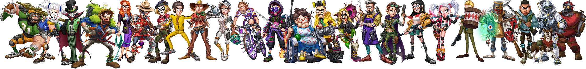

# Avatar设计

## 丰富的Avatar形象 

我们与世界各地的艺术家们精诚合作，设计出精美且异常丰富的Fighter Avatar形象，并通过区块链技术将他们以NFT的形式带给玩家。

目前已经完成了340+完全不同风格各异的Fighter形象，并且仍在不断增加中。

## 稀有突变AVATAR 

在目前已完成的340+Fighter形象的基础上，我们为其中一部分Fighter Avatar再次设计了稀有的突变后形象，突变形象可以认为是普通形象的全新进化。

有关AVATAR突变的详细规则，见：



