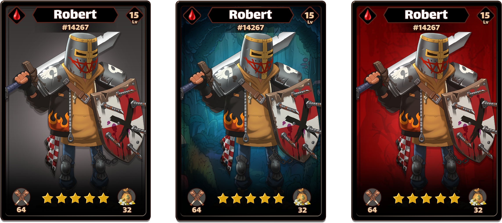
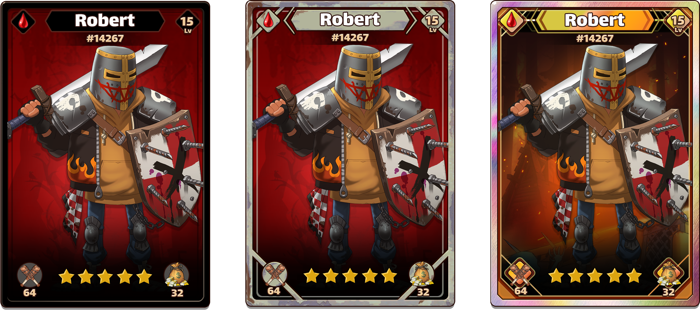
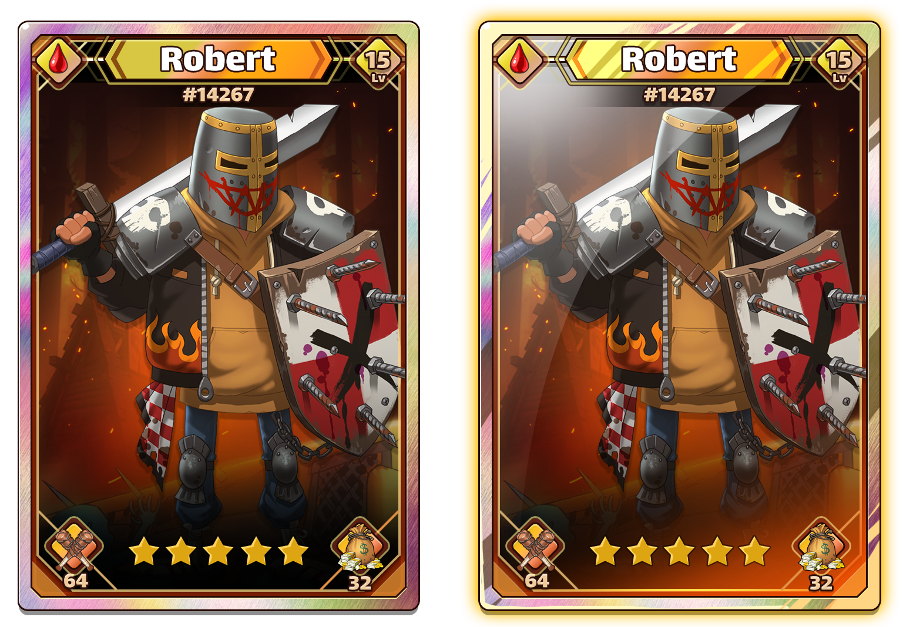

# 卡牌设计

每个Fighter Avatar，均配有不同星级、不同卡牌背景、不同卡牌边框、不同闪耀等级的卡牌形象，Fighter Avatar+卡牌形象则构成全部的卡牌库，极大的增加了卡牌的唯一性。列举如下：

| 卡牌属性 | 变化范围 | 游戏内功能 |
| :---: | :---: | :--- |
| 星级 | 1⭐-5⭐ | 星级越高，战斗力和经营能力越强 |
| 卡牌背景 | 已完成65种 | 不影响游戏内功能，仅有表现 |
| 卡牌边框 | 已完成34种 | 不影响游戏内功能，仅有表现 |
| 卡牌闪耀等级 | lv.1 - lv.485 | 不影响游戏内功能，仅有表现 |
| 是否变异 | 普通、变异 | 变异后拥有全新卡牌形象，同时会提高战斗力和经营能力 |

此项目中的Fighter卡牌，可通过一个简单的公式计算出所有可能的变化：

> 理论变化数   
> = Avatar形象\(342\) \* 卡牌背景\(65\) \* 卡牌边框\(34\) \* 卡牌闪烁等级\(485\) \* 是否变异\(2\)   
> = 733,145,400

7.3亿种完全不同的卡牌形象变化并且在不断增加中，足够玩到天荒地老。同时，仅有星级和变异等级会影响游戏数值，玩家不会因为数值而影响对卡牌本身的价值判断，去掉了想象力的枷锁，真正做到如NFT艺术品市场类似的独特性和稀缺性。

