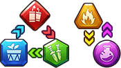

# 战斗

## 战斗过程

玩家携带1-5名Fighters加入战斗。战斗中，主要对抗的敌人是各种各样的僵尸。

* 每名Fighter和僵尸都按照攻击顺序进行普通攻击，普通攻击无需玩家操作。在普通攻击中，双方都可以积攒能量。
* 每位Fighter都拥有独特的技能，当Fighter能量已满时，玩家就可以在合适的时机、选中合适的敌人，通过点击Fighter头像手动释放技能。
* 敌人的能量已满时，他们会自动施放技能。

在战斗中，Fighter和敌人都拥有不同的颜色，颜色之间是相互克制的关系。

## 捕获僵尸

在战斗结束后，可以捕获僵尸加以净化。

