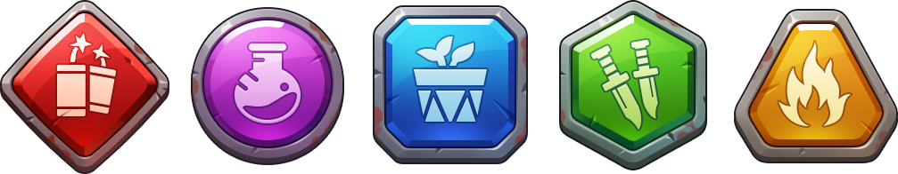

# Fighters

前文已述，每个Fighter卡牌都是独一无二的、拥有完全不同战斗力、经营能力和充满个性Avatar形象的NFT资产。

一旦玩家在游戏中拥有了自己的Fighter，这份财产就彻底属于玩家，拥有了完整的所有权和使用权，永远不属于某个中心化的游戏公司，永远不会受到任何其他人的影响，也绝不可能被人窃取。玩家拥有对自己财产的全部支配权，可以自由的使用和交易。

在实际游戏功能中，Fighter还具备着不同星级、颜色、等级、经营能力、战斗力和技能等多种独特属性。

## **星级**

星级代表了Fighters的稀有程度。

⭐是常见的Fighter，能力也最一般。

⭐⭐⭐⭐⭐则是超级稀有的Fighter，战斗力、经营能力和技能都是最强的。

| 星级 | 稀有度 | 战斗力 | 经营力 | 最高等级 |
| :---: | :---: | :---: | :---: | :---: |
| ⭐ | 普通 | 1x | 1x | 1 |
| ⭐⭐ | 优秀 | 2x | 2x | 3 |
| ⭐⭐⭐ | 稀有 | 3x | 5x | 10 |
| ⭐⭐⭐⭐ | 史诗 | 5x | 20x | 15 |
| ⭐⭐⭐⭐⭐ | 传奇 | 8x | 80x | 30 |

## **颜色**

每个Fighter都属于不同的元素，一共有五种：红色、绿色、蓝色、紫色、金色。

在战斗中，元素之间存在互相克制的关系。在经营时，当Fighter颜色与地块颜色一致后，经营能力还会有额外加成。

## **等级**

等级代表着Fighter的成长程度。提升等级后，Fighter的战斗力、技能等级和经营能力都会提高。

在经营地块和参与僵尸对抗的各种战斗中，都会提升英雄的等级。

## **经营能力**

经营能力越高，所经营地块的产出则会越多。

## **战斗力**

战斗力越高，Fighter在对决僵尸的冒险模式和竞技赛季的PVP玩法中，获得胜利的几率也会越大。

## **技能**

游戏中的技能种类异常丰富，在战斗中，玩家可以根据战场形势选择施放技能的时机。合理的分配技能施放时机和顺序是战斗胜利的关键！

