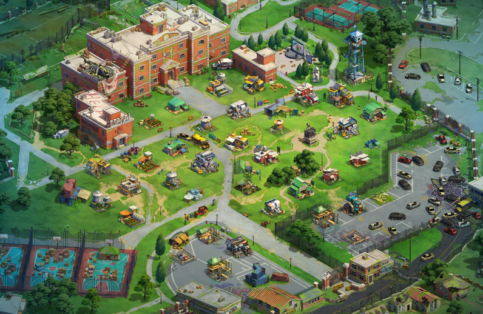
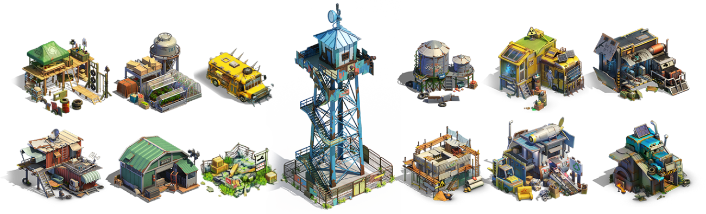
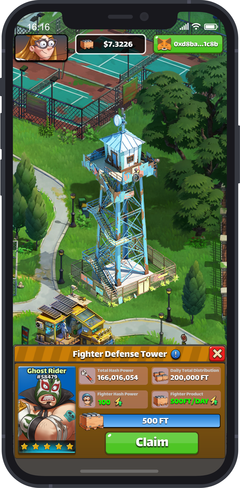

# 经营

每个新玩家进入游戏时，都会被系统赠送一位1星英雄和一块默认的庇护所地块用于经营发展。


领取初始1星英雄和初始地块仅需支付少量的Gas费。


在这片庇护所土地上，有很多不同种类的建筑，外观各不相同，因此也具有不同的经营范围。

玩家可以将自己的Fighters派驻到不同的建筑上开展经营。不同的Fighter具备不同的经营能力，和建筑的经营范围一一对应。

Fighter的经营能力越强，产出的$Zom数量越多。

每次玩家点击领取按钮，即可将尚未领取的$Zom领取至自己的钱包。

