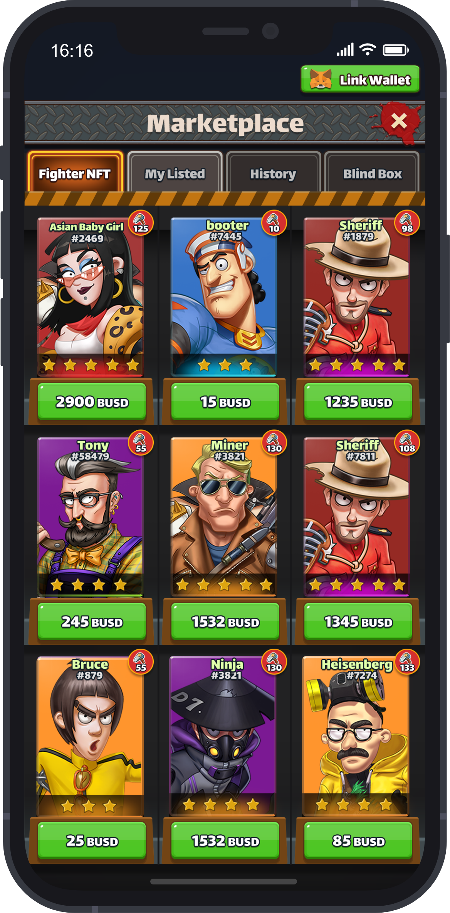

# 交易市场

交易市场是一个NFT去中心化交易所，玩家可以在这里自由买卖Fighter，还可以购买 & 开启盲盒。

玩家可以使用任何 BEP-20 Token参与市场上的交易活动，但目前优先使用$BUSD。其他Token将会稍后被添加。

为了提供最佳的用户体验和最低的交易费用，我们通过以下方式专门优化了智能合约：

* 可以在智能合约内直接进行交易Fighter NFT，所以用户无需在NFT市场交易前执行解锁。这种交易方式可以最大限度的减少Gas转账费用，从而给用户提供了低成本的NFT资产交易体验。
* 当玩家购买、出售Fighter NFT时，该Fighter 算力将自动的从用户的总算力中增加与减少，无需进行解锁、质押操作，从而节省了Gas转账费用。
* 交易市场还具有打包功能，使用户可以选择一次出售或购买多个$Fighter NFT。
* 平台收取5％的交易手续费，该收入将会流入回购池中以增加流动性。

