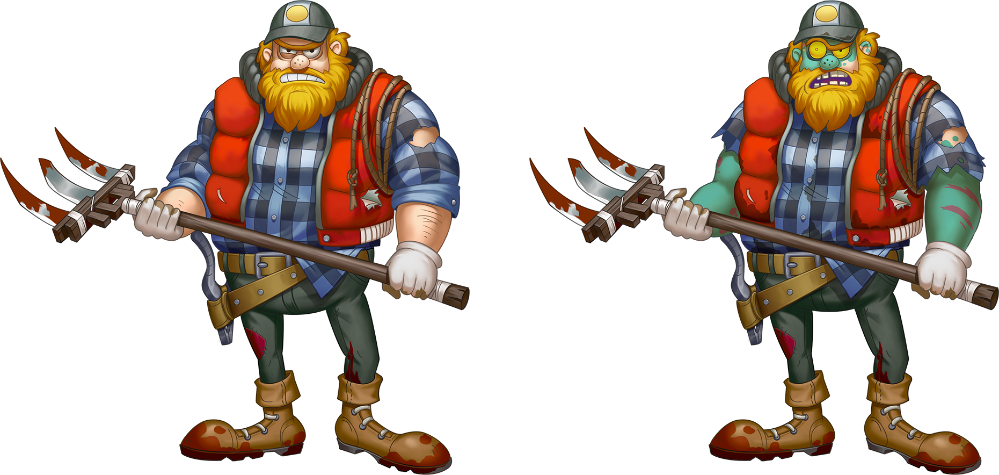

# 突变

由于受到末日科技的影响，庇护所内的净化车间有时不会很稳定，被净化的僵尸有时会发生突变。

当突变发生时，被净化的僵尸并不会从两名协作者的基因里继承其中一种，而会具备完全不一样的全新特性。突变并不一定是坏事情，有时候被净化的僵尸会突变出更加强大的基因。

## 突变条件

只有Fighter的AVATAR形象会发生突变，其余基因特性（属性、技能、卡牌背景和卡牌边框）则不会突变。但是，一旦突变，其余基因特性均会提高。

当被继承自双方协作者的AVATAR形象完全相同的情况下，新Fighter就有几率突变为一种全新的AVATAR形象了。突变的几率是25%。

随着项目开发进程，具备突变特性的AVATAR形象基因正在逐渐增加中。在未来，每个AVATAR形象都将有对应的最多4层的突变AVATAR形象。例如：某个AVATAR被命名为MrWhite，这个AVATAR突变后会被命名为Heisenberg。

### 一个完美基因情况下的突变例子

假如协作者1的P、H1、H2、H3位AVATAR基因全部相同，都是MrWhite，而协作者2的全部AVATAR基因位也都是MrWhite，那么——若没有突变设定——则新Fighter会100%继承MrWhite基因。但净化车间的不稳定导致新Fighter有25%的几率突变，因此全新Fighter有75%的几率未突变，仍然继承MrWhite，25%的几率突变为Heisenberg。

但是，实际的突变几率将会低于25%。因为双方协作者的8个基因位全部相同的几率实在是太低了。

### 另一个正常几率的突变例子

假如协作者1和2并非全部8个基因位都相同，而是双方只有P基因位相同，是MrWhite。那么，新Fighter突变为Heisenberg的几率是：

> 75% \* 75% \* 25% = 14%

### 一个极低几率的突变例子

假如协作者1和2只有H3基因位是MrWhite，那么新Fighter突变为Heisenberg的几率是：

> 1.6% \* 1.6% \* 25% = 0.0064%

## 突变效果

突变会使新Fighter的形象发生改变，并且与突变之前的形象有一定关联，如图：

另外，突变后的形象也可以继续发生突变，目前只制作了1层突变形象，最终版本会为某些形象制作最多4层突变形象4层突变形象，会成为游戏中最稀有的NFT资产。

